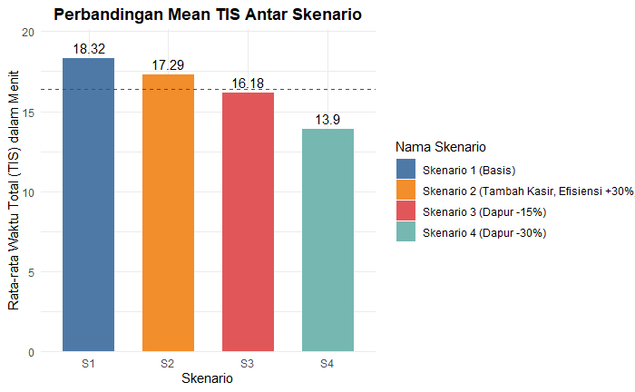

# Canteen Queue Optimization & Simulation

> **Topic:** Operational Research & Statistical Computing

> **Tech Stack:** R, RMarkdown, Iterative Algorithms

## 📌 Project Overview

This project addresses the bottleneck issue at the **ITERA Campus Canteen (BKL)** during peak hours. Using **Queueing Theory** and **Iterative Simulation Algorithms**, we analyzed service times and arrival rates to propose an optimal service model.

The goal was to minimize student waiting time while maximizing server utility, providing data-driven recommendations for canteen management.

  

## 📊 Methodology & Approach

1.  **Data Collection:** Conducted field observation (n=43 samples) to measure arrival intervals and service duration.
2.  **Data Munging:** Cleaning and transforming raw data using R.
3.  **Simulation:** Implemented a custom iterative algorithm in R to simulate queue behavior under different server scenarios (Single Channel vs. Multi-Channel).
4.  **Optimization:** Calculated optimal service rates to reduce bottlenecks.

## 📂 Repository Structure

- `src/`: Contains the RMarkdown (`.Rmd`) source code for the simulation logic.
- `data/`: Raw and processed datasets from field observations.
- `docs/`: Full technical report (PDF), scientific poster, and presentation slides.

## 📈 Key Findings

- The simulation identified that the **peak bottleneck** occurs between 12:00 - 13:00 PM.
- The iterative model suggests that adding **1 additional payment counter** reduces average waiting time by approximately **40%**.

---

## 👥 Credits

_Project developed for the Statistical Computing Course (SD3103)._

- **Khairunnisa Maharani** - Simulation Logic & R Implementation
- **Lutfia Aisyah P.** - Data Collection
- **Devi Rahayu** - Data Analysis
- **Ridho B. T.** - Documentation
